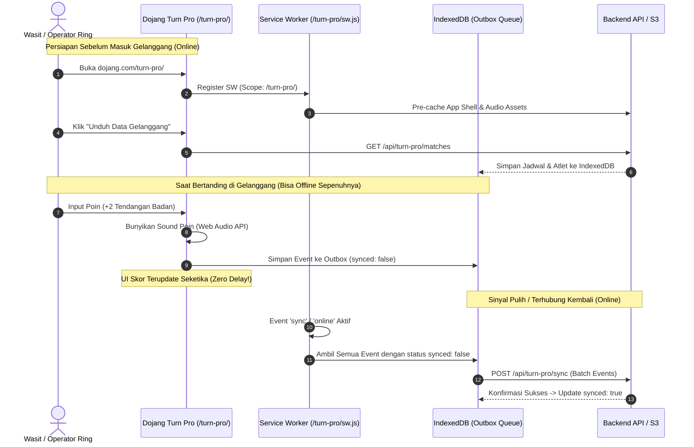

# Panduan Lengkap Arsitektur Multi-Subpath PWA & Offline-First Turnamen Dojang

Dokumentasi ini menjelaskan implementasi arsitektur **Progressive Web App (PWA)** pada sistem aplikasi **Dojang** dalam **1 domain tunggal** yang dibagi ke beberapa **subpath**:
* `/` : **Dojang Core** (Landing page publik, modul autentikasi & sesi terpusat)
* `/turn-pro/` : **Dojang Turn Pro** (Arena pertandingan & scoreboard dengan **Offline Capability**)
* `/coach/` : **Dojang Coach** (Portal pelatih)
* `/member/` : **Dojang Member** (Portal atlet)

Serta panduan infrastruktur cloud menggunakan **API Gateway / CloudFront dengan mapping ke AWS S3 Bucket**.

---

## 1. Arsitektur Sistem & Alur Kerja

Dalam 1 domain yang sama, Dojang Core mengelola landing page dan sesi login, sementara Dojang Turn Pro memiliki kebutuhan khusus di mana wasit dan operator arena **tetap bisa menjalankan pertandingan meskipun koneksi internet di venue terputus sepenuhnya**.



---

## 2. Struktur Folder Project

Implementasi ini dibuat modular dan siap dijalankan secara lokal:

```text
dojang-offline-pwa-demo/
├── client/                                # 📱 Frontend Multi-Subpath Apps
│   ├── package.json
│   └── public/
│       ├── sw.js                          # Service Worker Root Core (Scope: '/')
│       ├── index.html                     # Dojang Core (Root /): Public & Shared Login
│       ├── core.css                       # Styling Core Portal
│       ├── core.js                        # Login logic & registrasi Core SW
│       ├── turn-pro/                      # 🥋 Dojang Turn Pro (Arena Pertandingan)
│       │   ├── sw.js                      # ⚠️ Dedicated SW Turn Pro (Scope: '/turn-pro/')
│       │   ├── index.html                 # Scoreboard digital (Chong vs Hong) & Operator Console
│       │   ├── turn-pro.css               # Tampilan LED scoreboard arena
│       │   ├── turn-pro.js                # IndexedDB engine, sound synth, outbox sync, P2P channel
│       │   ├── display.html               # 📺 Layar Display Gelanggang (TV / Videotron Arena)
│       │   ├── display.css                # Styling stadium LED arena display
│       │   ├── display.js                 # Engine display penerima stream BroadcastChannel
│       │   └── manifest.json              # PWA manifest Turn Pro
│       ├── coach/                         # 🥋 Dojang Coach
│       │   ├── index.html                 # Dashboard pelatih binaan
│       │   └── coach.css
│       └── member/                        # 🥋 Dojang Member
│           ├── index.html                 # Kartu digital & info atlet
│           └── member.css
│
├── server/                                # 🖥️ Backend API & Mock Server
│   ├── src/
│   │   ├── routes/
│   │   │   ├── auth.routes.js             # API Login & Sesi
│   │   │   └── tournament.routes.js       # API Download Gelanggang & Batch Sync Outbox
│   │   ├── data/
│   │   │   └── mock-tournament.js         # Data master jadwal & partai
│   │   └── server.js                      # Express server dengan header SW yang aman
│   ├── .env.example
│   ├── .gitignore
│   └── package.json
│
├── infra/                                 # ☁️ Konfigurasi Cloud (API Gateway & S3)
│   ├── aws-apigateway-s3-architecture.md  # Panduan arsitektur CloudFront/API Gateway ke S3
│   ├── deploy-s3.sh                       # Script deploy ke S3 dengan metadata SW
│   └── cloudfront-functions/
│       └── viewer-request-spa.js          # CloudFront function untuk SPA fallback routing
│
└── README.md
```

---

## 3. Strategi Service Worker pada 1 Domain (Subpath Scope)

Browser mengizinkan **lebih dari satu Service Worker dalam 1 origin domain**, asalkan memiliki `scope` yang berbeda sesuai spesifikasi resmi W3C Service Worker API.

### Aturan Hirarki Scope Browser (Longest Prefix Match):
1. Ketika user berada di `dojang.com/`: browser dikendalikan oleh `/sw.js` (Scope: `/`).
2. Ketika user masuk ke `dojang.com/turn-pro/`: browser secara otomatis dikendalikan oleh `/turn-pro/sw.js` (Scope: `/turn-pro/`) karena kecocokan path yang lebih spesifik (*longest prefix match*).

---

### Opsi Implementasi: Dual SW vs Single SW (Hanya di Turn Pro)

#### Opsi 1: Hanya Mengaktifkan SW di Turn Pro (Direkomendasikan jika Core belum butuh PWA)
Jika Dojang Core (landing page & login portal) belum membutuhkan fitur offline, **Core TIDAK WAJIB memiliki Service Worker**:
* **Dojang Core:** Cukup berjalan sebagai web standar tanpa registrasi SW.
* **Dojang Turn Pro:** Tetap mendaftarkan SW mandiri di `/turn-pro/turn-pro.js` (`scope: '/turn-pro/'`).
* **Apakah Turn Pro tetap bisa offline?** **YA, 100% bisa.** Service Worker Turn Pro, cache aset arena, dan IndexedDB bersifat mandiri di subpath `/turn-pro/`. Browser tidak memerlukan Service Worker di root domain agar subpath dapat bekerja offline.
* **Bagaimana dengan sesi login?** Sesi login dari Core (`localStorage.getItem('dojang_auth_user')` atau Cookie) tetap dapat dibaca oleh Turn Pro karena berada dalam satu origin (`dojang.com`).

#### Opsi 2: Registrasi Dual Service Worker (Core + Turn Pro)
Bila Core nantinya juga membutuhkan kapabilitas PWA (misal offline caching untuk modul portal):

##### A. Di Dojang Core (`/core.js`):
```javascript
if ('serviceWorker' in navigator) {
  navigator.serviceWorker.register('/sw.js', { scope: '/' });
}
```

##### B. Di Dojang Turn Pro (`/turn-pro/turn-pro.js`):
```javascript
if ('serviceWorker' in navigator) {
  navigator.serviceWorker.register('/turn-pro/sw.js', { scope: '/turn-pro/' });
}
```

---

### Analisis Keamanan, Pros & Cons (Dual SW di 1 Domain)

Apakah aman mendaftarkan 2 Service Worker di 1 domain yang sama? **Aman**, namun ada beberapa pertimbangan:

| Aspek | Kelebihan (Pros) | Kekurangan & Risiko (Cons) |
| :--- | :--- | :--- |
| **Isolasi Modul (*Fault Isolation*)** | Bug / crash pada SW Turn Pro tidak merusak landing page atau alur login Core, dan sebaliknya. | Jika ada script bersama (*shared layout/header*) yang tidak sengaja me-load script Core di halaman Turn Pro, bisa terjadi registrasi ganda. |
| **Siklus Rilis (*Lifecycle Deploy*)** | Mandiri (*decoupled*). Update versi cache Turn Pro tidak memaksa user publik di landing page mengunduh ulang aset. | Butuh konfigurasi deploy CI/CD terpisah per bucket S3. |
| **Strategi Caching Berbeda** | Core bisa menggunakan `NetworkFirst` untuk konten dinamis, sedangkan Turn Pro menggunakan `CacheFirst` agresif untuk keandalan di gelanggang GOR. | **Cache Storage & IndexedDB bersifat 1 Origin:** Kedua SW berbagi namespace cache yang sama jika tidak dipisah secara eksplisit. |
| **Ukuran & Performa** | Pengunjung umum tidak perlu mengunduh aset scoreboard/audio Turn Pro yang besar. | Request lintas scope dari Turn Pro (misal panggil `/api/*` atau aset bersama) tetap ditangkap oleh SW Turn Pro. |

---

### ⚠️ Best Practices Wajib untuk Multi-SW:

1. **Namespace Cache Storage Wajib Dipisah:**
   Hindari pembersihan cache membabi buta saat event `activate`. Berikan prefix unik per aplikasi:
   ```javascript
   // Di /turn-pro/sw.js
   const EXPECTED_CACHES = ['turnpro-v1'];
   caches.keys().then(keys => Promise.all(
     keys
       .filter(k => k.startsWith('turnpro-') && !EXPECTED_CACHES.includes(k))
       .map(k => caches.delete(k))
   ));
   ```
2. **Selalu Gunakan Trailing Slash:**
   Gunakan `{ scope: '/turn-pro/' }` (jangan `/turn-pro` tanpa slash agar tidak mencocokkan path lain seperti `/turn-promosi`).
3. **PWA Manifest Independen:**
   Di file `/turn-pro/manifest.json`, pastikan `start_url` dan `scope` diarahkan ke `/turn-pro/` agar aplikasi Turn Pro bisa diinstal sebagai PWA mandiri di tablet/laptop wasit.

---

## 4. Arsitektur Offline-First Dojang Turn Pro

Pertandingan di GOR memiliki risiko tinggi kehilangan sinyal. Dojang Turn Pro menerapkan prinsip **Local-First**:

### 1. App Shell & Asset Pre-caching (`/turn-pro/sw.js`)
* Semua aset utama (`turn-pro.css`, `turn-pro.js`, UI) di-cache dengan strategi `CacheFirst`.
* Begitu arena dibuka sekali, aplikasi bisa dibuka kembali tanpa internet sama sekali.

### 2. Local-First Database (IndexedDB)
Tidak menggunakan `localStorage` (karena batas 5MB dan synchronous blocking). Kita menggunakan native **IndexedDB** dengan 2 Object Store:
* `matches`: Menyimpan data partai, atlet, ronde, dan aturan tanding lokal.
* `outbox`: Menyimpan seluruh aksi skor yang belum disinkronkan.

### 3. Outbox Pattern (Event Sourcing)
Setiap kali tombol poin atau gam-jeom ditekan:
* State UI berubah secara instan (*zero latency*).
* Suara audio buzzer/beep berbunyi langsung (*Web Audio API synth*).
* Dibuat sebuah objek log transaksi:
  ```json
  {
    "id": "evt-1728271000123-ab3x9",
    "matchId": "M-101",
    "targetCorner": "BLUE",
    "actionType": "BODY_KICK",
    "pointsDelta": 2,
    "round": 1,
    "timestamp": 1728271000123,
    "synced": false
  }
  ```
* Disimpan ke IndexedDB `outbox`.

### 4. Background Synchronization
* Saat koneksi internet kembali pulih (`online` event atau Service Worker Background Sync `sync-match-scores`), sistem mengambil seluruh event dengan `synced: false`.
* Dikirim dalam 1 panggilan batch ke `POST /api/turn-pro/sync`.
* Server memproses secara **idempotent** (mencegah duplikasi data poin).
* Setelah mendapat respon sukses, status event di IndexedDB diubah menjadi `synced: true`.

### 5. Display Monitor Gelanggang & BroadcastChannel API (`dojang_arena_channel`)
Untuk menampilkan papan skor digital ke TV/Proyektor gelanggang tanpa perlu koneksi internet atau server perantara:
* **Halaman Display Khusus**: `/turn-pro/display.html` (dapat dibuka di layar sekunder via HDMI / proyektor arena).
* **Komunikasi Ultra-Low Latency (< 1ms)**: Menggunakan native W3C **`BroadcastChannel` API** pada channel `dojang_arena_channel`.
  - Browser melakukan *Inter-Process Communication (IPC)* langsung di memori antar tab/jendela dalam 1 origin (`dojang.com`).
  - **100% Offline Capability**: Tidak membutuhkan kabel LAN router, WiFi gelanggang, WebSocket server, atau cloud bridge!
  - **Dual-Layer Fallback**: Dilengkapi fallback otomatis ke `window.addEventListener('storage')` melalui `localStorage` jika browser lama tidak mendukung BroadcastChannel.
  - **Heartbeat & Liveness Watchdog**: Operator mengirim sinyal detak jantung berkala setiap 2.5 detik untuk memastikan link monitor aktif dan mengukur latensi (ping < 1ms).

#### ❓ Mengapa Bisa Bekerja Tanpa Cloud Credentials? (Browser-Native Pub/Sub vs Cloud Pub/Sub)
Banyak developer mengira arsitektur Pub/Sub selalu membutuhkan cloud broker seperti AWS SNS/SQS, Google Cloud Pub/Sub, Pusher, atau Redis yang mewajibkan API Key / Secret Key:
* **Bukan Cloud Broker:** Pola Pub/Sub di sini adalah **fitur native browser (W3C HTML Living Standard)**.
* **Keamanan Berbasis Same-Origin Policy (SOP):** Browser menjamin bahwa pesan channel `dojang_arena_channel` **hanya** dapat didengar oleh halaman web dari domain dan port yang persis sama (`origin-isolated`).
* **Skenario Gelanggang Nyata:** Di gelanggang turnamen, laptop operator dihubungkan ke TV/Videotron penonton lewat kabel HDMI (*Extended Display*). Operator membuka konsol di layar laptop dan display monitor di layar TV. Karena kedua tab berjalan di browser yang sama, komunikasi berlangsung murni via RAM komputer lokal (*zero network packet*).
* **Kapan Cloud Credentials Dibutuhkan?** Cloud credentials / API token **hanya** dibutuhkan saat data outbox pertandingan disinkronkan ke cloud backend (`POST /api/turn-pro/sync`) saat internet venue kembali pulih.

---

## 5. Implementasi AWS: API Gateway & S3 Mapping

Karena sistem menggunakan **API Gateway / CloudFront dengan mapping ke S3 (serverless / tanpa Nginx)**, berikut konfigurasi yang harus diterapkan:

### Diagram Mapping S3:

```text
               ┌──> /api/*        ───> API Gateway / Node.js Backend
               │
Browser ──> CDN (CloudFront) ─┬──> /turn-pro/*  ───> S3 Bucket: dojang-turnpro
               ├──> /coach/*     ───> S3 Bucket: dojang-coach
               ├──> /member/*    ───> S3 Bucket: dojang-member
               └──> /* (Default) ───> S3 Bucket: dojang-core
```

### Dua Aturan Wajib untuk Service Worker di S3:

1. **Header `Service-Worker-Allowed`**:
   Karena file Service Worker berada di S3, CloudFront wajib menambahkan header HTTP berikut (via **CloudFront Response Headers Policy**):
   ```http
   Service-Worker-Allowed: /turn-pro/
   ```

2. **Header `Cache-Control` untuk `sw.js`**:
   Jangan biarkan CloudFront atau browser men-cache file `sw.js`!
   * Saat upload ke S3, gunakan flag:
     ```bash
     aws s3 cp ./client/public/turn-pro/sw.js s3://dojang-turnpro/sw.js \
       --content-type "application/javascript" \
       --cache-control "no-cache, no-store, must-revalidate"
     ```
   * Di CloudFront, buat Behavior khusus untuk path pattern `*/sw.js` dengan Cache Policy: **`CachingDisabled`**.

3. **SPA Routing Fallback (Deep Linking) di S3**:
   Gunakan **CloudFront Function** (lihat file `infra/cloudfront-functions/viewer-request-spa.js`) agar URL subpath seperti `/turn-pro/match/101` di-rewrite ke `/turn-pro/index.html` tanpa menghasilkan pesan error 404 dari S3.

---

## 6. Cara Menjalankan & Menguji Secara Lokal

### Langkah 1: Jalankan Server Demo
```bash
# Masuk ke direktori server
cd dojang-offline-pwa-demo/server

# Install dependensi (Express, CORS, Dotenv)
npm install

# Jalankan server
npm start
```
Server akan aktif di `http://localhost:3000`.

### Langkah 2: Uji Coba Alur Aplikasi

1. **Akses Dojang Core (Root):**
   * Buka browser ke `http://localhost:3000/`.
   * Anda akan melihat status Service Worker Core aktif (`Scope: http://localhost:3000/`).
   * Klik tombol **Masuk / Simpan Sesi** sebagai Wasit/Referee. Token tersimpan di LocalStorage dan bisa dibaca oleh semua subpath.

2. **Akses Dojang Turn Pro (Arena Pertandingan):**
   * Klik link atau buka `http://localhost:3000/turn-pro/`.
   * Anda akan masuk ke tampilan Scoreboard digital arena (Chong Biru vs Hong Merah).
   * Periksa konsol: Service Worker khusus Turn Pro aktif dengan scope `/turn-pro/`.
   * Klik tombol **"📥 Unduh Data Gelanggang"** untuk menyimpan data partai ke IndexedDB.

3. **Simulasi Mode Offline (Putus Sinyal):**
   * Klik tombol merah: **"🔌 Simulasikan Putus Sinyal (Offline)"** (atau matikan koneksi di DevTools -> Network -> Offline).
   * Status berubah menjadi **TERPUTUS (MODE OFFLINE)**.
   * Coba tekan tombol poin:
     * `+1 Pukulan`
     * `+2 Tendangan Badan`
     * `+3 Tendangan Kepala`
     * `+1 Gam-jeom`
   * Perhatikan: Skor langsung bertambah seketika, suara beep berbunyi, dan tabel log di bawah menunjukkan status **⏳ Pending di IndexedDB**.

4. **Simulasi Pulih Sinyal (Online Sync):**
   * Klik tombol hijau: **"🟢 Pulihkan Sinyal (Online)"**.
   * Sistem mendeteksi koneksi pulih dan langsung mengeksekusi sinkronisasi outbox ke server.
   * Status antrean berubah menjadi **✓ Tersinkronisasi** secara otomatis!

5. **Uji Coba Layar Display Monitor (TV / Proyektor Arena):**
   * Klik tombol toska: **"📺 Buka Display Monitor Gelanggang"** (terbuka di tab/window terpisah) atau tombol ungu: **"🪟 Simulasi Split-Screen"** untuk melihat preview di halaman yang sama.
   * Coba tekan tombol poin di konsol operator: Perhatikan layar display monitor langsung terupdate seketika (*zero delay*), suara beep berbunyi, dan muncul notifikasi *hit banner*!
   * Klik **"🏆 Deklarasi Pemenang"** untuk memicu layar kemenangan resmi (*Winner Overlay*).

6. **Uji Coba Telemetri Stream Data & Burst Test:**
   * Klik tombol oranye: **"⚡ Burst Test (5 Stream Data Sekaligus)"**.
   * Amati terminal **Telemetri Stream Data** di bagian bawah konsol: Anda dapat melihat paket data yang dipancarkan secara lokal (`tag-p2p`), antrean lokal (`tag-outbox`), serta respons server (`tag-cloud-ack`).

---

## 7. Verifikasi di Browser Developer Tools

Untuk memastikan arsitektur berjalan sesuai standar browser:

1. Buka **Chrome DevTools** (`F12`) -> Tab **Application**.
2. **Service Workers:**
   * Di `/`, Anda melihat 1 worker aktif: `/sw.js` (Scope `/`).
   * Di `/turn-pro/`, Anda melihat worker aktif: `/turn-pro/sw.js` (Scope `/turn-pro/`).
3. **Storage -> IndexedDB:**
   * Buka database `DojangTurnProDB`.
   * Buka object store `outbox` untuk melihat seluruh rekaman transaksi poin pertandingan yang disimpan secara lokal.
4. **Cache Storage:**
   * Buka `turn-pro-v2` untuk memverifikasi file HTML, CSS, JS arena pertandingan dan display monitor telah di-cache.
