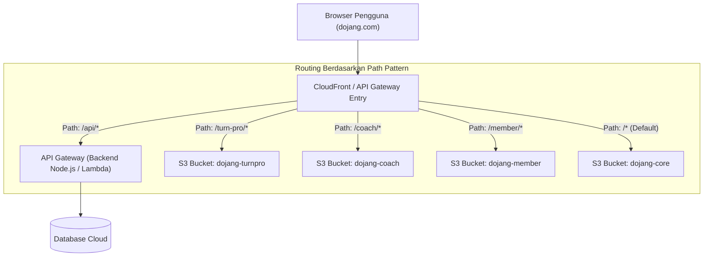

# Arsitektur AWS: API Gateway & S3 Mapping untuk Multi-Subpath PWA Dojang

Dokumentasi ini menjelaskan konfigurasi cloud ketika arsitektur Nginx digantikan oleh **AWS API Gateway / CloudFront dengan mapping ke AWS S3 Bucket**.

---

## 1. Diagram Arsitektur Cloud (Single Domain `dojang.com`)



---

## 2. Dua Masalah Krusial Service Worker di S3 & Solusinya

Saat beralih dari Nginx ke S3, browser memberlakukan aturan ketat pada Service Worker yang sering menjadi jebakan:

### Masalah 1: Header `Service-Worker-Allowed`
* **Gejala:** Service Worker `/turn-pro/sw.js` gagal didaftarkan jika scope melebihi batas default direktori atau jika dimapping dari origin terpisah.
* **Solusi di AWS:**
  Gunakan **CloudFront Response Headers Policy** atau **API Gateway Integration Response**:
  ```http
  Service-Worker-Allowed: /turn-pro/
  ```

### Masalah 2: Caching `sw.js` (Browser & CDN)
* **Gejala:** Pembaruan kode pertandingan di S3 tidak kunjung aktif di arena karena CloudFront / Browser men-cache file `sw.js` lama.
* **Solusi di AWS:**
  1. Set metadata saat upload S3:
     `--cache-control "no-cache, no-store, must-revalidate"`
  2. Buat Cache Behavior di CloudFront khusus path `*/sw.js` dengan Policy: **`Managed-CachingDisabled`**.

---

## 3. Konfigurasi Opsi A: CloudFront + Multi-S3 Origin (Rekomendasi Utama)

CloudFront adalah cara standar AWS untuk melayani static SPA dari S3 karena mendukung kompresi brotli/gzip otomatis, SSL gratis (ACM), dan edge performance super cepat.

### Mapping Behaviors di CloudFront:

| Path Pattern | Target Origin | Cache Policy | Response Headers Policy | Function Association |
| :--- | :--- | :--- | :--- | :--- |
| `/api/*` | API Gateway (Backend) | `CachingDisabled` | All Viewer Headers | - |
| `/turn-pro/sw.js` | S3 `dojang-turnpro` | `CachingDisabled` | Custom: Add `Service-Worker-Allowed: /turn-pro/` | - |
| `/turn-pro/*` | S3 `dojang-turnpro` | `CachingOptimized` | - | Viewer Request: `spa-rewrite` |
| `/coach/*` | S3 `dojang-coach` | `CachingOptimized` | - | Viewer Request: `spa-rewrite` |
| `/member/*` | S3 `dojang-member` | `CachingOptimized` | - | Viewer Request: `spa-rewrite` |
| `/sw.js` | S3 `dojang-core` | `CachingDisabled` | Custom: `Cache-Control: no-cache` | - |
| `Default (*)` | S3 `dojang-core` | `CachingOptimized` | - | Viewer Request: `spa-rewrite` |

---

## 4. Konfigurasi Opsi B: HTTP API Gateway v2 Murni ke S3 (Proxy Integration)

Jika Anda **tidak menggunakan CloudFront** dan murni mengarahkan DNS domain ke **AWS API Gateway (HTTP API v2)**:

### 1. Buat IAM Role untuk API Gateway
Role dengan izin `s3:GetObject` ke seluruh bucket Dojang:
```json
{
  "Version": "2012-10-17",
  "Statement": [
    {
      "Effect": "Allow",
      "Action": "s3:GetObject",
      "Resource": "arn:aws:s3:::dojang-*/*"
    }
  ]
}
```

### 2. Konfigurasi Route & Integrasi API Gateway:

#### A. Route Turn Pro SW (`GET /turn-pro/sw.js`)
* **Integration Type:** AWS Service (S3 GetObject)
* **Path:** `dojang-turnpro/sw.js`
* **Response Parameter Mapping:**
  ```yaml
  append:header:Service-Worker-Allowed: "'/turn-pro/'"
  append:header:Cache-Control: "'no-cache, no-store, must-revalidate'"
  append:header:Content-Type: "'application/javascript'"
  ```

#### B. Route Turn Pro Static (`GET /turn-pro/{proxy+}`)
* **Integration Type:** S3 GetObject
* **Path:** `dojang-turnpro/{proxy}`

#### C. Route Backend API (`ANY /api/{proxy+}`)
* **Integration Type:** HTTP URI Proxy ke server Express Node.js atau Lambda.

#### D. Route Default Core (`GET /{proxy+}`)
* **Integration Type:** S3 GetObject
* **Path:** `dojang-core/{proxy}`

---

## 5. Contoh Kode Terraform (Infrastructure as Code)

```hcl
# 1. Custom Response Header Policy untuk Service Worker
resource "aws_cloudfront_response_headers_policy" "sw_turnpro_policy" {
  name    = "dojang-turnpro-sw-headers"
  comment = "Header aman untuk Service Worker Turn Pro"

  custom_headers_config {
    items {
      header   = "Service-Worker-Allowed"
      value    = "/turn-pro/"
      override = true
    }
    items {
      header   = "Cache-Control"
      value    = "no-cache, no-store, must-revalidate"
      override = true
    }
  }
}

# 2. CloudFront Behavior untuk /turn-pro/sw.js
# Memastikan Service Worker tidak di-cache oleh CloudFront dan memiliki header scope yang tepat
```
