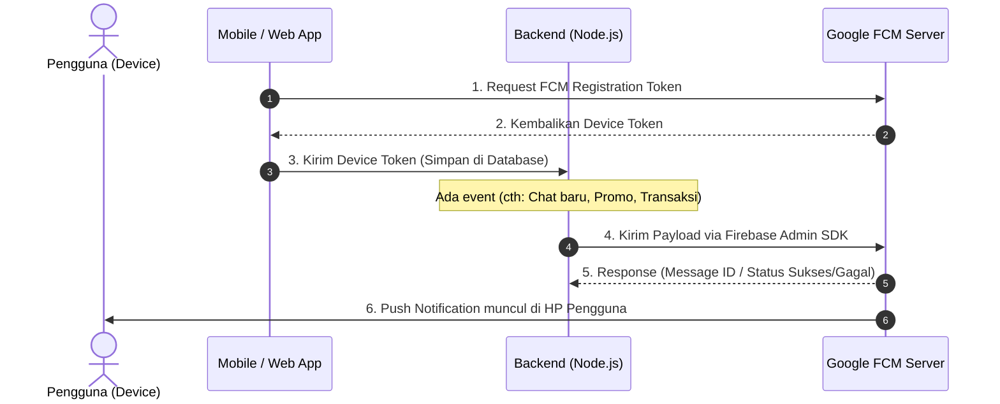
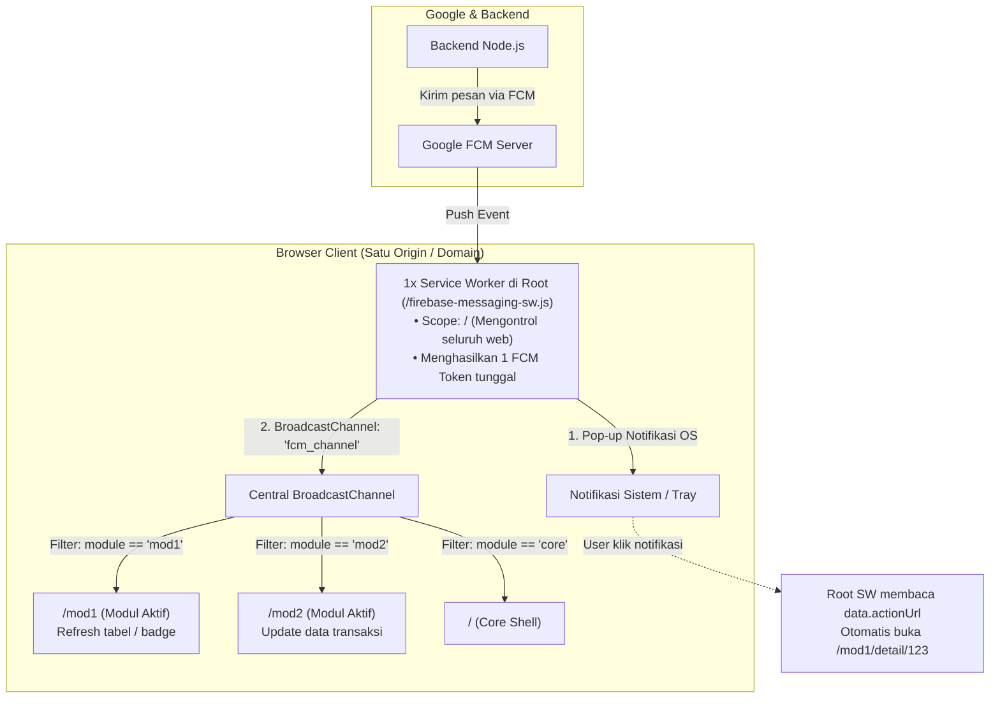
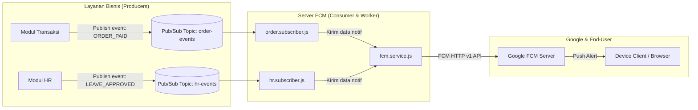
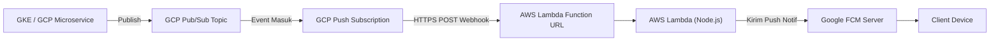

# Panduan Lengkap Firebase Cloud Messaging (FCM) dengan Node.js

Dokumentasi ini menjelaskan implementasi **Firebase Cloud Messaging (FCM)** menggunakan **Node.js** secara gamblang, praktis, dan sesuai dengan standar **FCM HTTP v1 API** (Firebase Admin SDK).

---

## 1. Arsitektur & Alur Kerja FCM

Secara umum, alur pengiriman pesan push notification FCM adalah sebagai berikut:



---

## 2. Persiapan (Firebase Console)

Sebelum masuk ke kode Node.js:
1. Buka [Firebase Console](https://console.firebase.google.com/).
2. Buat atau pilih project yang sudah ada.
3. Masuk ke **Project Settings** (ikon gear di kiri atas) -> tab **Service accounts**.
4. Pastikan pilihan bahasa pada **Node.js**, lalu klik **Generate new private key**.
5. Simpan file JSON tersebut (misalnya beri nama `service-account.json`).
> **Penting:** Jangan pernah commit file `service-account.json` ke repository publik (Git). Masukkan ke `.gitignore`!

---

## 3. Inisialisasi Project Node.js

### 3.1. Struktur Folder (Client & Server Architecture)

Dalam implementasi riil, FCM biasanya melibatkan dua sisi: **Client (Web/Mobile)** untuk meminta izin notifikasi & menerima token, serta **Server (Node.js)** untuk menyimpan token & mengirim push notifikasi.

Berikut struktur arsitektur project yang direkomendasikan:

```text
fcm-nodejs-demo/
├── client/                              # 📱 Frontend (Web Client - Vite)
│   ├── public/
│   │   └── firebase-messaging-sw.js     # ⚠️ WAJIB: Service Worker untuk notifikasi di background browser
│   ├── src/
│   │   ├── firebase-config.js           # Inisialisasi Firebase Web SDK (Client)
│   │   └── app.js                       # Logic minta izin notifikasi, toast pop-up, & kirim token
│   ├── index.html                       # Entry point UI Web (Wajib di root client untuk Vite)
│   ├── package.json
│   └── .env                             # VAPID Key & Public Firebase Web Config
│
├── server/                              # 🖥️ Backend (Node.js API, FCM Sender & PubSub Consumer)
│   ├── src/
│   │   ├── config/
│   │   │   ├── firebase.js              # Inisialisasi Firebase Admin SDK
│   │   │   └── pubsub.js                # Inisialisasi Client / Broker PubSub
│   │   ├── controllers/
│   │   │   └── notification.controller.js # Endpoint register token, kirim notif, & publish event
│   │   ├── routes/
│   │   │   └── notification.routes.js   # Route API (/api/tokens, /api/notifications, /api/events)
│   │   ├── services/
│   │   │   └── fcm.service.js           # Fungsi sendToToken, sendMulticast, sendToTopic
│   │   ├── pubsub/                      # ⚡ Integrasi Pub/Sub Event Consumer
│   │   │   ├── subscribers/
│   │   │   │   ├── order.subscriber.js  # Konsumsi event order -> trigger FCM
│   │   │   │   └── hr.subscriber.js     # Konsumsi event HR -> trigger FCM
│   │   │   └── pubsub.listener.js       # Inisialisasi listener pendaftaran subscriber
│   │   └── server.js                    # Entry point Express server & Pub/Sub boot
│   ├── service-account.json             # 🔒 Secret credential dari Firebase Console (JANGAN DI-COMMIT)
│   ├── .env                             # Port, Path service-account.json
│   ├── .gitignore
│   └── package.json
│
└── README.md
```

#### Penjelasan Komponen Penting:
1. **`client/public/firebase-messaging-sw.js` (Web Service Worker)**:
   - Harus diletakkan di root domain publik web (misal `/public/` atau dist root).
   - Wajib ada pada Web Push agar notifikasi tetap bisa diterima dan dimunculkan saat tab web diminimalkan atau ditutup.
2. **Client VAPID Key (Web Push Certificate)**:
   - Client Web membutuhkan `vapidKey` saat memanggil `getToken()`. Kunci ini digenerate di **Firebase Console** -> **Project Settings** -> tab **Cloud Messaging** -> section **Web configuration** (**Web Push certificates** -> *Generate key pair*).
3. **`server/service-account.json` (Server Private Key)**:
   - Hanya boleh berada di server/backend. Client sama sekali tidak boleh mengakses kredensial ini karena memiliki hak akses admin penuh ke Firebase project.
4. **Alur Komunikasi Client-Server**:
   - Web Client meminta izin notifikasi via `Notification.requestPermission()`.
   - Web Client mengambil token perangkat via `getToken(messaging, { vapidKey })`.
   - Web Client mengirimkan token tersebut ke server via API: `POST /api/tokens/register`.
   - Server menyimpan token ke database (diasosiasikan dengan User ID).
   - Ketika ada event pengiriman, Server mengambil token dari database lalu menembak ke FCM melalui `firebase-admin`.

---

### 3.2. Setup Client (Web Browser Snippet)

Bagi sisi Web Client, berikut contoh kode singkat pengambil token dan Service Worker:

#### a. `client/public/firebase-messaging-sw.js` (Background Handler)
```javascript
importScripts('https://www.gstatic.com/firebasejs/10.12.0/firebase-app-compat.js');
importScripts('https://www.gstatic.com/firebasejs/10.12.0/firebase-messaging-compat.js');

firebase.initializeApp({
  apiKey: "AIzaSy...",
  projectId: "your-project-id",
  messagingSenderId: "1234567890",
  appId: "1:1234567890:web:abcdef"
});

const messaging = firebase.messaging();

// Menangani notifikasi saat tab/aplikasi browser di background
messaging.onBackgroundMessage((payload) => {
  console.log('[firebase-messaging-sw.js] Notifikasi background:', payload);
  const notificationTitle = payload.notification?.title || 'Pemberitahuan';
  const notificationOptions = {
    body: payload.notification?.body,
    icon: payload.notification?.icon || '/icon.png',
    data: payload.data
  };

  self.registration.showNotification(notificationTitle, notificationOptions);
});
```

#### b. `client/src/app.js` (Minta Izin & Registrasi Token ke Backend)
```javascript
import { initializeApp } from 'firebase/app';
import { getMessaging, getToken, onMessage } from 'firebase/messaging';

const firebaseConfig = {
  apiKey: "AIzaSy...",
  projectId: "your-project-id",
  messagingSenderId: "1234567890",
  appId: "1:1234567890:web:abcdef"
};

const app = initializeApp(firebaseConfig);
const messaging = getMessaging(app);

// 1. Minta izin dan ambil token
async function requestPermissionAndGetToken() {
  const permission = await Notification.requestPermission();
  if (permission === 'granted') {
    const currentToken = await getToken(messaging, {
      vapidKey: 'PASTE_YOUR_PUBLIC_VAPID_KEY_HERE'
    });
    
    if (currentToken) {
      console.log('FCM Token Client:', currentToken);
      // Kirim token ke Server Node.js untuk disimpan ke database
      await fetch('/api/tokens/register', {
        method: 'POST',
        headers: { 'Content-Type': 'application/json' },
        body: JSON.stringify({ userId: 'user_123', token: currentToken })
      });
    }
  } else {
    console.warn('Izin notifikasi ditolak oleh pengguna.');
  }
}

// 2. Listener saat aplikasi aktif di foreground (tab sedang dibuka pengguna)
onMessage(messaging, (payload) => {
  console.log('Notifikasi diterima saat foreground:', payload);
  alert(`${payload.notification.title}\n${payload.notification.body}`);
});
```

---

### 3.3. Install Dependency Server (Node.js)
Masuk ke folder `server/` dan jalankan di terminal:
```bash
npm init -y
npm install firebase-admin dotenv express
```

### 3.4. Konfigurasi `.env` & `.gitignore` Server

**`server/.gitignore`**:
```gitignore
node_modules/
service-account.json
.env
```

**`server/.env`**:
```env
PORT=3000
FIREBASE_SERVICE_ACCOUNT_PATH=./service-account.json
```

---

### 3.5. Kasus Khusus: Arsitektur Modular / Micro-Frontend (Mapping API Gateway)

Jika aplikasi menggunakan arsitektur modular yang dimapping oleh API Gateway pada **domain yang sama**:
- `/` $\rightarrow$ Core App (Root Shell)
- `/mod1` $\rightarrow$ Module 1
- `/mod2` $\rightarrow$ Module 2
- `/mod3` $\rightarrow$ Module 3 (dst.)

#### 📌 Ringkasan Solusi (The Golden Rule)
> **Apakah perlu SW di tiap module?**  
> **TIDAK.** Anda **HANYA BUTUH 1 SERVICE WORKER (di Root `/`)** dan **1 CENTRAL BROADCAST CHANNEL**.  
> **JANGAN** membuat 2 atau lebih SW di sub-modul!



#### 📋 Checklist: Apa yang Perlu & Tidak Perlu Ada di Tiap Modul?

| Komponen | Status di Tiap Modul (`/mod1`, `/mod2`) | Keterangan |
| :--- | :---: | :--- |
| **File `sw.js` / Service Worker** | ❌ **TIDAK PERLU** | Dilarang membuat SW terpisah di sub-modul agar token tidak bentrok. Cukup 1 SW di Root Core App. |
| **SDK Firebase (`firebase/messaging`)** | ❌ **TIDAK PERLU** | Modul tidak perlu install library Firebase apa pun (menghemat ukuran bundle JS modul secara drastis). |
| **Request Izin (`requestPermission`)** | ❌ **TIDAK PERLU** | Izin browser sudah diminta satu kali di tingkat Root Core App. |
| **Listener `BroadcastChannel`** | ✅ **WAJIB ADA** | Menggunakan Web API bawaan browser `new BroadcastChannel('fcm_channel')` tanpa dependency pihak ketiga. |
| **Logika Reaksi UI Lokal** | ✅ **PERLU ADA** | Fungsi untuk update badge counter, refresh query data tabel, atau memunculkan custom in-app banner/toast. |
| **Route / Deep Link Target** | ✅ **PERLU ADA** | Komponen route di modul yang cocok dengan path `actionUrl` dari backend (contoh: `/mod1/cuti/detail/:id`). |

---

#### Mengapa Cukup 1 SW di Root dan Bukan di Tiap Modul?
1. **FCM Token Terikat pada 1 ServiceWorkerRegistration**: Browser hanya mengizinkan 1 push subscription aktif per domain. Jika ada banyak SW di tiap modul, token akan terfragmentasi, bentrok (*race condition*), dan user tidak akan menerima notifikasi jika sedang tidak membuka modul tersebut.
2. **Scope Hierarki Browser**: Service Worker yang didaftarkan di root `/` (`scope: '/'`) secara otomatis **mengontrol seluruh sub-path** di bawahnya (`/mod1`, `/mod2`, `/mod3`).
3. **Perbedaan Keperluan Antar-Modul**: Perbedaan fitur, icon, dan data antar-modul diselesaikan melalui **Metadata Payload (`data.module` & `data.actionUrl`)**, bukan dengan memecah file Service Worker.

---

#### 🛠️ Detail Implementasi 3 Langkah

##### Langkah 1: Backend Menyisipkan Metadata Modul di Payload FCM
Saat backend mengirim notifikasi, cantumkan modul target dan URL aksi di dalam object `data`:
```javascript
// Contoh di Backend (Node.js) saat ada event di Modul 1
const message = {
  token: targetUserToken,
  notification: {
    title: 'Pengajuan Cuti Disetujui ✅',
    body: 'Pengajuan cuti Anda telah disetujui oleh atasan.'
  },
  data: {
    module: 'MOD1_HR',                      // 👈 Penanda modul
    actionUrl: '/mod1/cuti/detail/992',     // 👈 Path tujuan saat notifikasi diklik
    entityId: '992',
    timestamp: String(Date.now())
  }
};

await admin.messaging().send(message);
```

##### Langkah 2: Service Worker di Root (`/public/firebase-messaging-sw.js`)
Service Worker bertugas:
1. Menampilkan notifikasi sistem dengan icon sesuai modul.
2. Mem-broadcast pesan ke modul yang sedang aktif melalui **`BroadcastChannel`**.
3. Menangani klik notifikasi (`notificationclick`) untuk mengarahkan pengguna ke path modul yang tepat (`actionUrl`).

```javascript
importScripts('https://www.gstatic.com/firebasejs/10.12.0/firebase-app-compat.js');
importScripts('https://www.gstatic.com/firebasejs/10.12.0/firebase-messaging-compat.js');

firebase.initializeApp({
  apiKey: "AIzaSy...",
  projectId: "your-project-id",
  messagingSenderId: "1234567890",
  appId: "1:1234567890:web:abcdef"
});

const messaging = firebase.messaging();

// 📢 Inisialisasi Central BroadcastChannel untuk komunikasi ke tab/modul
const fcmBroadcast = new BroadcastChannel('fcm_channel');

// 1. Terima Push Message di Background
messaging.onBackgroundMessage((payload) => {
  const mod = payload.data?.module;

  // Sesuaikan icon / sound berdasarkan modul
  let iconUrl = '/assets/default-icon.png';
  if (mod === 'MOD1_HR') iconUrl = '/mod1/assets/hr-icon.png';
  if (mod === 'MOD2_FINANCE') iconUrl = '/mod2/assets/finance-icon.png';

  // Siarkan ke tab/modul yang sedang terbuka
  fcmBroadcast.postMessage({
    type: 'BACKGROUND_PUSH_RECEIVED',
    payload: payload
  });

  // Tampilkan notifikasi pop-up OS
  return self.registration.showNotification(payload.notification.title, {
    body: payload.notification.body,
    icon: iconUrl,
    data: payload.data // Simpan data untuk dibaca saat diklik
  });
});

// 2. Handler Saat Notifikasi Diklik oleh User
self.addEventListener('notificationclick', (event) => {
  event.notification.close();
  const targetUrl = event.notification.data?.actionUrl || '/';

  event.waitUntil(
    clients.matchAll({ type: 'window', includeUncontrolled: true }).then((windowClients) => {
      // Jika sudah ada tab yang terbuka, bawa ke depan dan navigasikan ke URL modul
      for (const client of windowClients) {
        if ('focus' in client) {
          client.navigate(targetUrl);
          return client.focus();
        }
      }
      // Jika belum ada tab yang terbuka, buka tab baru ke modul tersebut
      if (clients.openWindow) {
        return clients.openWindow(targetUrl);
      }
    })
  );
});
```

##### Langkah 3: Listener di Masing-Masing Modul (`mod1`, `mod2`, dst.)
Di masing-masing bundle modul (misal `mod1/src/app.js`), cukup buat listener ke **`BroadcastChannel('fcm_channel')`** yang sama dan filter berdasarkan `module`:

```javascript
// Contoh di Modul 1 (/mod1/src/index.js)
const fcmBroadcast = new BroadcastChannel('fcm_channel');

fcmBroadcast.onmessage = (event) => {
  const { payload } = event.data;

  // Filter: hanya proses jika pesan ini ditujukan untuk Modul 1
  if (payload.data?.module === 'MOD1_HR') {
    console.log('[Modul 1] Menerima update real-time:', payload);

    // Lakukan aksi spesifik Modul 1
    // Contoh: Refresh tabel, update counter badge, atau jalankan fetch data baru
    if (typeof refreshApprovalList === 'function') {
      refreshApprovalList();
    }
  }
};
```

```javascript
// Contoh di Modul 2 (/mod2/src/index.js)
const fcmBroadcast = new BroadcastChannel('fcm_channel');

fcmBroadcast.onmessage = (event) => {
  const { payload } = event.data;

  // Filter: hanya proses jika pesan ini ditujukan untuk Modul 2
  if (payload.data?.module === 'MOD2_FINANCE') {
    console.log('[Modul 2] Menerima update pembayaran:', payload);
    // Jalankan aksi spesifik Modul 2
    updateTransactionSummary();
  }
};
```

---

#### 📊 Rekapitulasi Arsitektur Modular

| Komponen | Jumlah | Lokasi | Peran |
| :--- | :---: | :--- | :--- |
| **Service Worker** | **1** | Di Root Core App (`/firebase-messaging-sw.js`) | Menangkap push event FCM secara global, generate 1 device token, memunculkan notifikasi OS, dan mengatur navigasi klik. |
| **FCM Token Per User** | **1** | Disimpan di Database Backend | Backend cukup mengirim ke 1 token saja per device user, tidak peduli user sedang di modul mana. |
| **BroadcastChannel** | **1** | `'fcm_channel'` (dibagi antar-modul) | Jembatan komunikasi real-time dari Service Worker ke tab modul yang sedang aktif di layar. |
| **Listener Modul** | **Sesuai Modul** | Di dalam source code masing-masing modul (`mod1`, `mod2`, dst.) | Memfilter pesan berdasarkan `payload.data.module` dan mengeksekusi logika lokal modul. |


---

### 3.6. Arsitektur Terintegrasi: Pub/Sub & Push Notification (Event-Driven Architecture)

Dalam sistem berskala produksi, pengiriman push notifikasi sering kali dipicu oleh **peristiwa bisnis** (seperti: transaksi berhasil, cuti disetujui, chat baru). Agar API bisnis tidak terbebani waktu tunggu pengiriman FCM, digunakanlah pola **Pub/Sub (Publish/Subscribe)**.

#### 1. Diagram Alur Pub/Sub $\rightarrow$ FCM



#### 2. Struktur Modul Pub/Sub di Server

Sesuai rekomendasi, logika Pub/Sub diorganisasi dalam folder tersendiri di dalam backend:

```text
server/src/
├── config/
│   ├── firebase.js                 # Inisialisasi Firebase Admin
│   └── pubsub.js                   # Adapter Message Broker (EventEmitter / Google PubSub / Redis)
├── pubsub/
│   ├── subscribers/
│   │   ├── order.subscriber.js     # Handler saat ada event order (ORDER_PAID, ORDER_SHIPPED)
│   │   └── hr.subscriber.js        # Handler saat ada event HR (LEAVE_APPROVED, LEAVE_REJECTED)
│   └── pubsub.listener.js          # Inisialisasi listener pendaftaran seluruh subscriber
├── services/
│   └── fcm.service.js              # Eksekutor pengiriman FCM
```

#### 3. Cara Kerja & Contoh Implementasi

##### a. Adapter Pub/Sub (`src/config/pubsub.js`)
Menggunakan EventEmitter internal (non-blocking) untuk demo, dengan antarmuka yang siap diganti ke Google Cloud Pub/Sub atau Redis di production:
```javascript
const EventEmitter = require('events');
const broker = new EventEmitter();

function publish(topic, payload) {
  setImmediate(() => broker.emit(topic, payload));
}

function subscribe(topic, handler) {
  broker.on(topic, handler);
}

module.exports = { publish, subscribe };
```

##### b. Subscriber Handler (`src/pubsub/subscribers/order.subscriber.js`)
Mendengarkan event bisnis dari topik dan memanggil `fcmService`:
```javascript
const fcmService = require('../../services/fcm.service');

async function handleOrderEvent(eventData) {
  const { eventType, userId, orderId, totalAmount, deviceToken } = eventData;

  if (!deviceToken) return;

  if (eventType === 'ORDER_PAID') {
    await fcmService.sendToToken({
      token: deviceToken,
      title: 'Pembayaran Diterima 💳',
      body: `Pesanan #${orderId} senilai Rp${totalAmount.toLocaleString()} telah dikonfirmasi.`,
      data: {
        module: 'MOD_ORDER',
        actionUrl: `/orders/detail/${orderId}`
      }
    });
  }
}

module.exports = { handleOrderEvent };
```

##### c. Inisialisasi Subscriber saat Server Boot (`src/server.js`)
Saat Express server dinyalakan, fungsi `initPubSubListeners()` otomatis dipanggil untuk mengaitkan subscriber ke topiknya:
```javascript
const { initPubSubListeners } = require('./pubsub/pubsub.listener');

app.listen(PORT, () => {
  console.log(`Server aktif di port ${PORT}`);
  initPubSubListeners(); // 👈 Aktifkan listener
});
```

---

#### 4. Uji Coba Simulasi Event Pub/Sub via API

Untuk menguji alur kerja Pub/Sub yang memicu pengiriman FCM, Anda dapat menembak endpoint testing berikut:

**Endpoint**: `POST http://localhost:3000/api/events/publish`

**Contoh Payload Uji Coba Order Paid (cURL)**:
```bash
curl -X POST http://localhost:3000/api/events/publish \
  -H "Content-Type: application/json" \
  -d '{
    "topic": "order-events",
    "eventData": {
      "eventType": "ORDER_PAID",
      "userId": "user_123",
      "orderId": "ORD-9982",
      "totalAmount": 250000
    }
  }'
```

*Jika `user_123` sudah mendaftarkan tokennya di server melalui Web Client, maka event ini akan langsung dikonsumsi oleh `order.subscriber.js` dan push notification akan muncul di layar pengguna!*

---

### 3.7. Arsitektur Cross-Cloud (AWS Lambda + GCP Pub/Sub & FCM) & Analisis Biaya

Banyak arsitektur perusahaan menempatkan sistem utama di **AWS** (misal API Gateway & AWS Lambda), namun tetap membutuhkan **Google Cloud Pub/Sub & FCM** untuk produk tertentu.

#### 1. Cara Menjalankan Cross-Cloud (AWS Lambda $\leftrightarrow$ GCP)

Ada 2 pola implementasi utama:

##### Pola A: GCP Pub/Sub Menembak AWS Lambda (Push Subscription Webhook) — *Rekomendasi Utama*

- **Cara Kerja**: Di GCP Console, buat subscription bertipe **Push** dan arahkan URL target ke **AWS Lambda Function URL** (atau AWS API Gateway). Setiap ada pesan masuk di GCP, Google akan otomatis menembak webhook HTTPS ke AWS Lambda.

##### Pola B: AWS Lambda Memanggil GCP Pub/Sub / FCM secara Langsung (Direct SDK)
Di dalam kode AWS Lambda (Node.js), install SDK `@google-cloud/pubsub` atau `firebase-admin`:
```javascript
// Di AWS Lambda Handler
const { PubSub } = require('@google-cloud/pubsub');
const admin = require('firebase-admin');

// Kredensial diambil aman dari AWS Secrets Manager / Environment Variable
const pubsub = new PubSub({
  projectId: process.env.GCP_PROJECT_ID,
  credentials: JSON.parse(process.env.GCP_SERVICE_ACCOUNT_KEY)
});

exports.handler = async (event) => {
  // Publish event ke GCP Pub/Sub langsung dari AWS Lambda
  await pubsub.topic('order-events').publishMessage({
    json: { orderId: 'ORD-123', status: 'PAID' }
  });
  return { statusCode: 200, body: 'Published to GCP' };
};
```

---

#### 2. Perbandingan: GCP Pub/Sub vs AWS SNS vs AWS EventBridge

| Fitur / Karakteristik | Google Cloud Pub/Sub | AWS SNS | AWS EventBridge |
| :--- | :--- | :--- | :--- |
| **Konsep Utama** | **All-in-One Broker** (Topic + Buffer Queue) | **Fast Fan-out** (Push-only broadcast) | **Smart Event Bus** (Schema & content router) |
| **Penyimpanan (Retention)** | **Ada (1 - 7 hari)** secara default | **Tidak ada** (harus dipasangkan SQS) | **Ada** (Archive & Replay event) |
| **Kebutuhan Service Tambahan** | **Mandiri** (1 produk mencakup Topic + Sub) | **Butuh AWS SQS** agar antrian aman | Mandiri / opsional SQS |
| **Content Filtering** | Berdasarkan SQL-like message attributes | Berdasarkan Message Attributes | **Sangat Kaya** (Filter langsung isi JSON body) |
| **Kemudahan Integrasi** | Sangat mudah jika ada komponen di GCP | Paling mudah untuk broadcast cepat di AWS | Paling cocok untuk microservices di AWS |

---

#### 3. Analisis Biaya (*Cost Analysis*) & Skema Free Tier

Meskipun berjalan lintas cloud (*cross-cloud*), biaya menggunakan Google Cloud Pub/Sub + FCM **sangat terjangkau bahkan sering kali Rp 0**:

##### A. Firebase Cloud Messaging (FCM)
* **Biaya**: **100% GRATIS ($0)** tanpa batasan kuota pesan bulanan (*unlimited*).

##### B. Google Cloud Pub/Sub
* **Free Tier Bulanan**: **10 GB pertama per bulan GRATIS ($0)**.
  - Rata-rata ukuran pesan event notifikasi (JSON) adalah **~1 KB**.
  - Kuota 10 GB gratis setara dengan **± 10.000.000 (10 Juta) event per bulan**.
* **Di atas 10 GB**: Hanya dikenakan biaya **~$0.04 per GB** (~$40 / TiB).

##### C. Data Transfer / Egress (GCP ke AWS)
* GCP menyediakan kuota keluar internet gratis hingga **200 GB per bulan**.
* Melebihi kuota: ~$0.08 - $0.12 per GB (karena payload JSON sangat kecil, biaya egress bulanan umumnya hanya bernilai beberapa sen dollar).

##### D. Estimasi Biaya Nyata Bulanan:

| Skenario Penggunaan | Volume Pesan / Bulan | Biaya FCM | Biaya GCP Pub/Sub | Biaya Egress GCP | Total Biaya GCP |
| :--- | :---: | :---: | :---: | :---: | :---: |
| **Startup / Menengah** | **1.000.000 pesan** (~1 GB) | $0 | $0 *(Free Tier)* | $0 *(Free Tier)* | **$0 / bulan** |
| **Skala Besar** | **50.000.000 pesan** (~50 GB) | $0 | ~$1.60 | ~$4.00 | **~$5.60 / bulan** (~Rp 90.000) |

##### E. Tips Menghemat Biaya di AWS:
1. **Gunakan AWS Lambda Function URL**: Hindari membuat REST API Gateway jika hanya untuk menerima webhook Pub/Sub. Function URL Lambda **gratis** (tidak ada biaya per request API Gateway).
2. **Push Mode ketimbang Polling**: Biarkan GCP menembak ke AWS Lambda (*Push Subscription*). Hindari membuat polling loop tanpa pesan dari AWS ke GCP.

---

## 4. Inisialisasi Firebase Admin SDK

Buat file inisialisasi (misal di awal script Node.js):

```javascript
// Menggunakan CommonJS (require)
const admin = require('firebase-admin');
const path = require('path');
require('dotenv').config();

const serviceAccountPath = process.env.FIREBASE_SERVICE_ACCOUNT_PATH || './service-account.json';
const serviceAccount = require(path.resolve(serviceAccountPath));

// Inisialisasi SDK
admin.initializeApp({
  credential: admin.credential.cert(serviceAccount)
});

// Referensi ke service messaging
const messaging = admin.messaging();
```

*(Jika menggunakan ES Module / `"type": "module"`, ganti `require` dengan `import` dan load file JSON via `createRequire` atau fs).*

---

## 5. Tipe Pesan FCM

Ada 2 jenis payload utama di FCM:
1. **Notification Message**: Otomatis ditampilkan oleh OS di notification tray saat aplikasi berada di *background*/*killed*.
2. **Data Message**: Berisi key-value custom string. Tidak otomatis menampilkan popup; payload langsung diproses oleh kode aplikasi client (*background processing/silent notification*).
3. **Kombinasi (Notification + Data)**: Menampilkan popup notifikasi sekaligus membawa data custom ke aplikasi saat notifikasi diklik.

---

## 6. Contoh Kode Implementasi (Sample Code)

Berikut adalah kumpulan contoh kode yang siap digunakan.

### Sample 1: Kirim Notifikasi ke 1 Device (Single Device)

```javascript
/**
 * Mengirim notifikasi ke satu token perangkat
 */
async function sendToSingleDevice(targetToken) {
  const message = {
    token: targetToken,
    notification: {
      title: 'Pesanan Diproses 📦',
      body: 'Pesanan #INV-12345 sedang dikemas oleh penjual.',
      imageUrl: 'https://placehold.co/600x400/png' // Opsional
    },
    data: {
      orderId: 'INV-12345',
      screen: 'ORDER_DETAIL',
      click_action: 'FLUTTER_NOTIFICATION_CLICK' // Biasa dipakai pada Flutter/Android
    },
    // Konfigurasi spesifik Android
    android: {
      priority: 'high',
      notification: {
        sound: 'default',
        channelId: 'order_updates_channel' // Wajib untuk Android 8.0+
      }
    },
    // Konfigurasi spesifik iOS (APNs)
    apns: {
      payload: {
        aps: {
          sound: 'default',
          badge: 1
        }
      }
    }
  };

  try {
    const response = await admin.messaging().send(message);
    console.log('✅ Pesan berhasil dikirim. Message ID:', response);
    return response;
  } catch (error) {
    console.error('❌ Gagal mengirim pesan:', error);
    throw error;
  }
}
```

---

### Sample 2: Kirim ke Banyak Device Sekaligus (Multicast / Batch)

Gunakan method **`sendEachForMulticast`** (pengganti `sendMulticast` yang telah deprecated).

```javascript
/**
 * Mengirim notifikasi ke banyak perangkat sekaligus (maks 500 token per batch)
 */
async function sendToMultipleDevices(tokens) {
  const message = {
    tokens: tokens, // Array of FCM tokens (string[])
    notification: {
      title: 'Promo Kilat Hari Ini! ⚡',
      body: 'Dapatkan diskon hingga 50% hanya untuk 2 jam ke depan.'
    },
    data: {
      promoCode: 'FLASH50',
      type: 'PROMO'
    }
  };

  try {
    const response = await admin.messaging().sendEachForMulticast(message);

    console.log(`Berhasil terkirim: ${response.successCount}`);
    console.log(`Gagal terkirim: ${response.failureCount}`);

    // Menangani token yang tidak valid / expired
    if (response.failureCount > 0) {
      const failedTokens = [];
      response.responses.forEach((resp, idx) => {
        if (!resp.success) {
          const errCode = resp.error?.code;
          failedTokens.push({
            token: tokens[idx],
            error: errCode
          });

          // Token tidak valid atau user sudah uninstall aplikasi
          if (
            errCode === 'messaging/registration-token-not-registered' ||
            errCode === 'messaging/invalid-registration-token'
          ) {
            console.warn(`⚠️ Token mati/kadaluarsa terdeteksi: ${tokens[idx]}`);
            // TODO: Hapus token ini dari database Anda!
          }
        }
      });
      console.log('Daftar token gagal:', failedTokens);
    }

    return response;
  } catch (error) {
    console.error('❌ Gagal kirim multicast:', error);
    throw error;
  }
}
```

---

### Sample 3: Menggunakan Topic Messaging (Publish / Subscribe)

Sangat efisien untuk broadcast berita, update cuaca, atau pengumuman massal tanpa perlu menyimpan ribuan token di memori server.

```javascript
/**
 * 1. Mendaftarkan token ke suatu topik
 */
async function subscribeDeviceToTopic(tokens, topicName) {
  // tokens bisa berupa string tunggal atau array string
  const response = await admin.messaging().subscribeToTopic(tokens, topicName);
  console.log(`Sukses subscribe ${response.successCount} token ke topik "${topicName}"`);
}

/**
 * 2. Mengirim pesan ke suatu topik
 */
async function sendToTopic(topicName) {
  const message = {
    topic: topicName,
    notification: {
      title: 'Pengumuman Maintenance Server 🛠️',
      body: 'Sistem akan maintenance pada pukul 00:00 WIB.'
    },
    data: {
      type: 'ANNOUNCEMENT'
    }
  };

  try {
    const response = await admin.messaging().send(message);
    console.log(`✅ Pesan berhasil dikirim ke topik "${topicName}":`, response);
    return response;
  } catch (error) {
    console.error('❌ Gagal kirim ke topik:', error);
  }
}
```

---

### Sample 4: Silent Notification / Data-Only Message (Background Sync)

Berguna untuk meminta client melakukan sinkronisasi data tanpa memunculkan banner notifikasi ke user.

```javascript
/**
 * Mengirim silent message (hanya payload data)
 * Catatan: Semua value dalam `data` HARUS bertipe string!
 */
async function sendSilentDataMessage(targetToken) {
  const message = {
    token: targetToken,
    data: {
      action: 'SYNC_OFFLINE_DATABASE',
      timestamp: String(Date.now()),
      syncId: '88231'
    },
    android: {
      priority: 'high' // Penting agar aplikasi bangun di background
    },
    apns: {
      headers: {
        'apns-priority': '5',
        'apns-push-type': 'background'
      },
      payload: {
        aps: {
          'content-available': 1 // Wajib untuk background push di iOS
        }
      }
    }
  };

  return await admin.messaging().send(message);
}
```

---

## 7. Error Handling & Kode Error Umum

Saat mengirim pesan, Firebase Admin SDK akan melempar error code jika terjadi kegagalan:

| Error Code | Penyebab | Solusi |
| :--- | :--- | :--- |
| `messaging/invalid-registration-token` | Format string token salah/korup. | Validasi string token sebelum kirim. |
| `messaging/registration-token-not-registered` | User telah uninstall aplikasi atau token expired. | **Wajib hapus token ini dari database** agar tidak membebani kuota & resource. |
| `messaging/message-rate-too-high` | Terlalu banyak pesan dikirim ke satu device secara bersamaan. | Beri jeda (throttle/rate limit) atau gabungkan pesan. |
| `messaging/server-unavailable` | Server FCM sedang sibuk atau down sementara. | Lakukan retry dengan *Exponential Backoff*. |
| `messaging/payload-size-limit-exceeded` | Ukuran payload melebihi batas (maks 4KB untuk notifikasi, 4KB untuk data). | Perkecil ukuran isi pesan atau URL gambar. |

---

## 8. Best Practices untuk Production

1. **Gunakan Background Queue (Worker)**
   - Jangan kirim push notifikasi langsung di HTTP request controller/handler API yang blocking.
   - Gunakan message queue seperti **BullMQ / Redis**, **RabbitMQ**, atau **Kafka** untuk memproses pengiriman FCM di background.
2. **Batasi Multicast Batch ke 500 Token**
   - Batas maksimal `sendEachForMulticast` adalah 500 token per batch. Jika ada 10.000 user, bagi array token menjadi potongan 500 token (`chunk(tokens, 500)`).
3. **Pembersihan Token Berkala (Token Lifecycle)**
   - Hapus token saat menerima respon `registration-token-not-registered`.
   - Update token di database setiap kali aplikasi client melakukan update/login baru.
4. **Keamanan Kredensial**
   - Pada cloud provider (AWS / GCP / Docker / Kubernetes), hindari hardcode file JSON. Anda dapat memanfaatkan environment variable stringified JSON atau IAM Workload Identity jika berada di Google Cloud.

---

## 9. Panduan Menjalankan & Menguji Demo Secara Lokal

Aplikasi demo ini terdiri dari dua sisi: **Server (Node.js)** dan **Client (Vite Web App)**.

### 9.1. Menjalankan Backend Server
1. Masuk ke folder server dan pasang dependensi:
   ```bash
   cd fcm-nodejs-demo/server
   npm install
   ```
2. Letakkan file kredensial `service-account.json` dari Firebase Console di dalam folder `server/`.
3. Pastikan file `.env` di folder `server/` terisi:
   ```env
   PORT=3000
   FIREBASE_SERVICE_ACCOUNT_PATH=./service-account.json
   ```
4. Jalankan server:
   ```bash
   npm start
   ```
   *Server akan berjalan di `http://localhost:3000` dan menginisialisasi listener Pub/Sub.*

### 9.2. Menjalankan Frontend Web Client
1. Buka terminal baru, masuk ke folder client:
   ```bash
   cd fcm-nodejs-demo/client
   npm install
   ```
2. Buat / lengkapi file `.env` di folder `client/` dengan konfigurasi Web App & VAPID Key:
   ```env
   VITE_FIREBASE_API_KEY=AIzaSy...
   VITE_FIREBASE_AUTH_DOMAIN=your-project-id.firebaseapp.com
   VITE_FIREBASE_PROJECT_ID=your-project-id
   VITE_FIREBASE_STORAGE_BUCKET=your-project-id.appspot.com
   VITE_FIREBASE_MESSAGING_SENDER_ID=335732295529
   VITE_FIREBASE_APP_ID=1:335732295529:web:abcdef
   VITE_FIREBASE_VAPID_KEY=B... (Kunci Web Push Certificates)
   VITE_API_BASE_URL=http://localhost:3000
   ```
3. Sesuaikan juga objek `firebaseConfig` di file `client/public/firebase-messaging-sw.js` agar sama dengan konfigurasi di atas.
4. Jalankan client:
   ```bash
   npm run dev
   ```
   *Buka antarmuka web di browser pada `http://localhost:5173`.*

### 9.3. Alur Pengujian Notifikasi
1. **Minta Izin & Terbitkan Token**:
   - Di browser `http://localhost:5173`, klik tombol biru **"1. Minta Izin & Ambil FCM Token"**.
   - Klik **Allow** pada pop-up izin notifikasi browser.
   - String FCM registration token perangkat Anda akan otomatis muncul di textarea.
2. **Daftarkan Token ke Server**:
   - Klik tombol hijau **"2. Kirim Token ke Server"** (User ID default: `user_123`).
   - Log akan mencatat: `✅ Token berhasil disimpan di server untuk User [user_123]!`.
3. **Kirim Notifikasi via Curl (HTTP Sync)**:
   ```bash
   curl -X POST http://localhost:3000/api/notifications/send-user \
     -H "Content-Type: application/json" \
     -d '{
       "userId": "user_123",
       "title": "Halo dari FCM! 👋",
       "body": "Notifikasi Push berhasil masuk ke layar Anda!"
     }'
   ```
4. **Kirim Notifikasi via Event Pub/Sub (Async Worker)**:
   ```bash
   curl -X POST http://localhost:3000/api/events/publish \
     -H "Content-Type: application/json" \
     -d '{
       "topic": "order-events",
       "eventData": {
         "eventType": "ORDER_PAID",
         "orderId": "ORD-2026",
         "totalAmount": 250000,
         "userId": "user_123"
       }
     }'
   ```
   - **Saat Tab Aktif (Foreground)**: Muncul notifikasi Toast animasi di pojok kanan atas layar web.
   - **Saat Tab Di-minimize / Background**: Muncul pop-up banner push notification native OS.

---

## 10. Panduan Deployment ke Cloud (AWS / GCP) & Registrasi Domain

Ketika aplikasi di-deploy ke lingkungan server cloud (seperti AWS ECS/EC2/S3 atau GCP Cloud Run/GKE/Compute Engine), perhatikan aspek-aspek berikut:

### 10.1. Apakah Perlu Mendaftarkan Domain?

#### A. Sisi Frontend (Web Client / PWA):
1. **Wajib Menggunakan HTTPS (SSL/TLS)**:
   - Standar keamanan browser (W3C Push API & Service Worker) **mewajibkan protokol HTTPS**.
   - Service Worker **tidak akan bisa aktif** pada domain publik berprotokol HTTP biasa (hanya `localhost` yang diizinkan untuk development).
   - Oleh karena itu, domain web Anda (misal `https://app.domainanda.com`) wajib dipasangi sertifikat SSL (misal via AWS Certificate Manager + CloudFront, atau GCP Cloud Load Balancing / Let's Encrypt).
2. **Authorized Domains di Firebase Console**:
   - Jika Anda menggunakan **Firebase Authentication** untuk login pengguna, domain web Anda wajib didaftarkan di:  
     **Firebase Console -> Authentication -> Settings -> Authorized domains** -> klik **Add domain**.
   - Untuk Web Push FCM sendiri, otentikasi client dilakukan melalui pasangan **VAPID Key (Key Pair)** yang dicocokkan oleh Google Push Service, sehingga domain tidak wajib didaftarkan di panel tersendiri selain memastikan HTTPS aktif dan CORS diizinkan.

#### B. Sisi Backend (Node.js API Server):
1. **Pengaturan CORS (Cross-Origin Resource Sharing)**:
   - Di `server/src/server.js`, atur whitelist domain frontend produksi Anda agar browser tidak memblokir fetch API register token:
     ```javascript
     app.use(cors({
       origin: ['https://app.domainanda.com', 'https://admin.domainanda.com'],
       credentials: true
     }));
     ```
2. **Manajemen Kredensial Firebase di Cloud**:
   - **Google Cloud Platform (GCP)** (Cloud Run / GKE / GCE):
     - **Rekomendasi Utama**: Tidak perlu mengunggah file `service-account.json`. Cukup pasang Service Account GCP dengan role `Firebase Admin SDK Administrator` pada Cloud Run atau VM Anda.
     - Firebase Admin SDK otomatis mendeteksi kredensial dari lingkungan (*Application Default Credentials* / ADC):
       ```javascript
       admin.initializeApp(); // Otomatis membaca ADC tanpa file json!
       ```
   - **Amazon Web Services (AWS)** (ECS / EC2 / Lambda):
     - Simpan isi `service-account.json` di **AWS Secrets Manager** atau **SSM Parameter Store**.
     - Inject sebagai environment variable (misal `FIREBASE_CONFIG_BASE64` atau mount file secara aman di runtime container), hindari menyimpan file kredensial ke Docker image publik.

